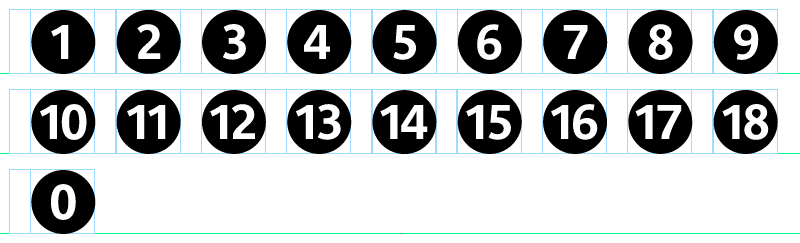
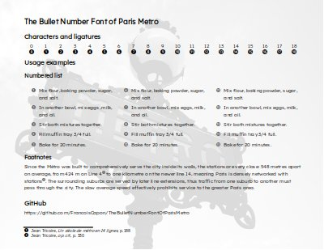

#  The Bullet Number Font of Paris Metro (PMBN)

For a long time ago, I wanted to use bullet numbers in my documents (desktop application or web) but I could never find a satisfactory and free solution.

Although I am a complete newbie in typography and fonts, I decided to build my own font using the **Paris underground lines numbers**.



The result of my work could be useful for everybody, so I publish it! 

## The font caracteristics

.png)

### The metrics


The characters are inscribed in a square:
- `square side = circle diameter` (no `side bearings`)
- the circle fills the entire `ascender` (no `descender`, no `overshoot`)

So, it's very easy :
- to add your own `right and left side bearings`
- to adjust the size of the `PMBN` to the `caps height` of the appaired font using a percent

### The characters and the ligatures

Each character or ligature correspond to it character in a the ascii table, so:
- here is no need using utf-8 codes or table of special characters
- "applications" can numbering items like they using a standard text font 

#### The characters

```
1 = (1), 2 = (2), ..., 8 = (8), 9 = (9)
```

#### The ligatures

```
1 + 0 = (10), 1 + 1 = (11), ..., 1 + 7 = (17), 1 + 8 = (18)
```

#### Why `(0)`?

The zero is for the ligature ten and Firefox, because it check that the two ligatured characters are in the same font.

So, if Firefox doesn't find the character zero in the `PMBN`, it uses a fallback font for the zero and he will not apply the ligature. And of course no matter the glyph of the zero for the ligature, but it was easy to use the `(10)` to design the `(0)`.

This is not the case for "Chrome & Co", they apply the ligature even the zero doesn't exist in the `Paris Metro Bullet Number Font`.

## Used in a desktop application

1. Install the `ParisMetroBulletNumber-Symbol.otf` font on your OS
1. Use it in your application

### Example
- for a numbered list:
    - define a character style with the `PMBN` and the size in percent (of the appaired text font)
    - use this character sytle in a numbering style for the numbers
    - et voilà!
     
- [PDF created with Libre Office and the `PMBN`](doc/bullet-number-paris-metro-otf-font-demo.pdf)

[](doc/bullet-number-paris-metro-otf-font-demo.pdf)


## Used for the web

You can use it as another standard web font.

```css
/* a ordered list with number in PMBN */
@font-face {
    /* Paris Metro Bullet Number */
    font-family: "PMBN";
    /* woff for IE11 */
    src: url("ParisMetroBulletNumber-Symbol.woff2") format("woff2"),
         url("ParisMetroBulletNumber-Symbol.woff") format("woff"); 
}

/* https://stackoverflow.com/questions/11946098/how-to-remove-dot-after-number-in-ordered-list-items-in-ol-li */

ol {
    counter-reset: item;
}

ol li {
    display: block
}

ol li:before {
    content: counter(item);
    counter-increment: item;
    font-family: PMBN;
    /* Adjust for your appaired font*/
    font-size: 75%;
    color: dimgray;
    background-color: transparent;
    padding-right: 0.5em;
}
```
Since the size of the font file is very small, you can also embeded the `woff2` file directely in a `css` file:

```css
 @font-face {
    font-family: 'PMBN';
     /* copy and paste the content of ParisMetroBulletNumber-Symbol.woff2.base64 after base64, */
    src: url(data:application/x-font-woff2;base64,d09GMgABAAAAAAiQAA8.....L4dp8VospZV5KZb2al4wBQA=);
```

## The tools used
1. [Glyphr Studio](https://www.glyphrstudio.com/): a free, web based font designer online 🌟
    - No registration needed to save/reload a projet
    - Well documented :
        - [tutorial](https://glyphrstudio.com/tutorial/)
        - [documentation](http://help.glyphrstudio.com/)
    - Easy to use: the proof is that I achived my goal (build my own font from existing svg files) 😉
1. [cloudConvert/Font Converter](https://cloudconvert.com/font-converter): free and oneline
    - Glyphr Studio produce only `otf` fonts, so I needed of a converter `otf` to `woff` and `woff2`


